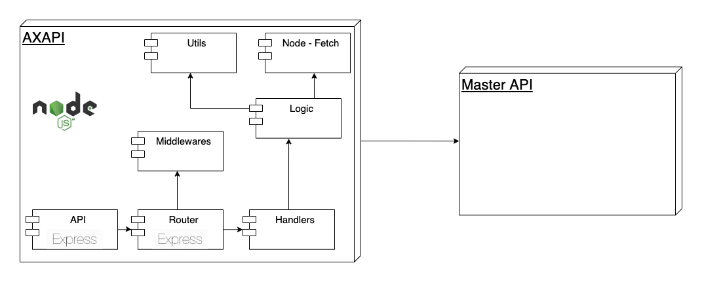

# AXAPI

## Introduction

Axapi is a REST API middleware that connects with a master API and provides a new and more useful interface for client.

## How to run it

### Important!

For running this API is required the `.env` file, which is not included in this repository for security reasons.
You can create your own at the root and store in it the following values: 
```
PORT: The port where the app will be listening
API_URL: The master API URL
USERNAME: Credentials to authenticate with master API
PASSWORD: Credentials to authenticate with master API
JWT_SECRET: A secret to sign JSON web tokens
JWT_EXP = JSON web tokens expiration time
```

### Install dependencies

```
$ npm i
```

### Run tests

```
$ npm test
```

### Run API
```
$ npm start
```

After running it, you will get a prompt message with a confirmation and the URL it is listenint.

Example:
```
🚀 Server up and running at http://localhost:8085
```


## Functional description

The API exposes a main entry point at `/api`.

### Endpoints

A full description of this API endpoints can be found [here](https://dare-nodejs-assessment.herokuapp.com/assessment-swagger/static/index.html#/).

## Technical description

This API runs on Node.js and is build with Express.js.

### Block diagram

